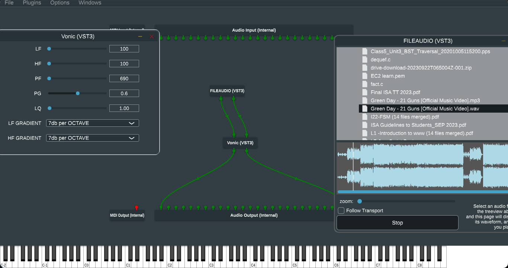

# Vonic
### By Vortex

- Audio Plugin Created using the [JUCE](https://github.com/juce-framework/JUCE) Plugin.
- Performs Attenuation and Amplification of lowband and high band frequencies with optional adjustment of Gain.
- Future Prospects : Audio Visualizer and a more comprehensive UI (As soon as i get some time).

## Build Instructions :

 - Follow the instructions to build JUCE and Projucer from the official docs.
 - Create the new Projucer project and enable Interfaces as per operating System requirements(Generally AU/VST3 macOS  and VST3 for others).
 - Enable the Debug mode.
 - Add the dsp module to the list of modules of projucer project settings.
 - Save the settings and navigate to project directory.
 - In the Project Directory navigate to `Build/your/operating/system`.
 - Build the project as per steps specific to your OS.

